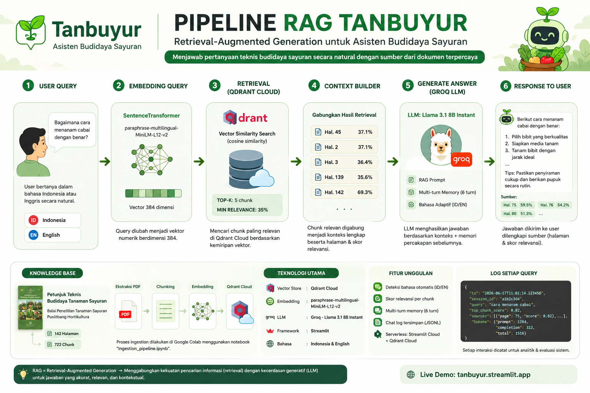

# 🌱 Tanbuyur — Asisten Budidaya Sayuran

> **Tanbuyur** = Asis**tan** **Bu**didaya Sa**yur**an — Asisten Budidaya Sayuran

Chatbot pertanian berbasis **Retrieval-Augmented Generation (RAG)** yang menjawab pertanyaan teknis budidaya sayuran secara natural, dengan sumber dari dokumen *Petunjuk Teknis Budidaya Tanaman Sayuran* (Balai Penelitian Tanaman Sayuran, Puslitbang Hortikultura).

🔗 **Live demo:** [tanbuyur.streamlit.app](https://tanbuyur.streamlit.app)

---

## Fitur Utama

| Fitur | Detail |
|---|---|
| 📚 Knowledge base | *Petunjuk Teknis Budidaya Tanaman Sayuran* — 142 halaman, 722 chunk, 30 jenis sayuran |
| 🔍 Vector store | Qdrant Cloud — cosine similarity, remote & scalable |
| 🌐 Embedding | `paraphrase-multilingual-MiniLM-L12-v2` — mendukung Bahasa Indonesia & Inggris |
| 🤖 LLM | Groq — Llama 3.1 8B Instant |
| 🧠 Multi-turn memory | 6 turn terakhir diingat per sesi |
| 📊 Relevance scoring | Skor cosine per chunk ditampilkan sebagai badge di setiap jawaban |
| 🌏 Deteksi bahasa | Query Indonesia/Inggris dideteksi otomatis, jawaban menyesuaikan |
| 🛡️ Guardrail Python | Validasi tanaman sebelum ke LLM — topik di luar DB tidak sampai ke Groq |
| 🔄 Query expansion | Sinonim otomatis: "nanam" → "budidaya penanaman", "hama" → "OPT", dll. |
| 🏷️ Answer mode badge | Setiap jawaban dibadge: 🟢 Dokumen / 🔴 Luar Database / 🔵 Daftar Isi |
| 📋 Chat log | Setiap sesi tersimpan ke `logs/chat_log.jsonl` + `plant_detected` & `retrieval_success` |
| 🚀 Deployment | Streamlit Cloud + Qdrant Cloud — serverless, tanpa file lokal |

---

## Arsitektur



---

## Struktur Proyek

```
tanbuyur/
├── app.py                        # Aplikasi Streamlit utama
├── ingestion_pipeline.ipynb      # Notebook Colab: PDF → Qdrant Cloud
├── README.md
├── requirements.txt
├── .gitignore
├── .streamlit/
│   └── secrets.toml.example     # Template secrets (jangan commit yang asli!)
└── logs/
    └── chat_log.jsonl            # Dibuat otomatis saat ada query
```

---

## Cara Pakai

### 1. Ingest PDF ke Qdrant Cloud (Google Colab)

Buka `ingestion_pipeline.ipynb` di Colab:

1. **Cell 1** — Install dependencies, lalu **restart runtime**
2. **Cell 2** — Upload file PDF
3. **Cell 3–4** — Ekstraksi teks & chunking otomatis
4. **Cell 5** — Isi `QDRANT_URL` dan `QDRANT_API_KEY`, lalu push ke Qdrant Cloud
5. **Cell 6–8** — Validasi retrieval & ringkasan

> Proses embedding 722 chunk memakan waktu ±3–5 menit di Colab free tier.

### 2. Setup Lokal

```bash
git clone https://github.com/whddarmadi/tanbuyur.git
cd tanbuyur

pip install -r requirements.txt

cp .streamlit/secrets.toml.example .streamlit/secrets.toml
# Edit secrets.toml — isi ketiga key di bawah
```

Isi `.streamlit/secrets.toml`:

```toml
GROQ_API_KEY   = "gsk_xxxx..."
QDRANT_URL     = "https://xxxx.cloud.qdrant.io"
QDRANT_API_KEY = "your-qdrant-api-key"
```

```bash
streamlit run app.py
```

### 3. Deploy ke Streamlit Cloud

1. Push repo ke GitHub
2. Buka [share.streamlit.io](https://share.streamlit.io) → **New App** → pilih repo, branch `main`, file `app.py`
3. **Settings > Secrets** — tambahkan ketiga key di atas
4. **Settings > Python version** — pastikan Python 3.11 (atau buat `runtime.txt` berisi `python-3.11.9`)
5. Deploy — cold start ±30–60 detik (hanya download embedding model ~118MB sekali)

---

## Parameter Konfigurasi

Semua parameter utama ada di bagian `CONFIG` di `app.py`:

```python
COLLECTION_NAME      = "sayuran_kb"
EMBED_MODEL          = "paraphrase-multilingual-MiniLM-L12-v2"
EMBED_DIM            = 384
GROQ_MODEL           = "llama-3.1-8b-instant"
TOP_K                = 5       # Jumlah chunk diambil dari Qdrant
MIN_RELEVANCE        = 0.35    # Threshold minimum retrieval
RAG_SCORE_THRESHOLD  = 0.50    # Di bawah ini = out-of-domain, tidak panggil LLM
MAX_MEMORY_TURNS     = 6       # Turn percakapan yang disimpan sebagai memori
```

---

## Format Log

Setiap query tersimpan ke `logs/chat_log.jsonl`:

```json
{
  "ts": "2026-06-17T11:02:14.123456",
  "session_id": "a1b2c3d4",
  "query": "cara menanam cabai",
  "answer": "...",
  "answer_mode": "RAG",
  "plant_detected": "cabai",
  "retrieval_success": true,
  "top_chunk_score": 0.82,
  "chunks_used": 4,
  "sources": [
    {"page": 23, "score": 0.82},
    {"page": 24, "score": 0.76}
  ],
  "tokens": {"prompt": 1204, "completion": 312, "total": 1516}
}
```

`answer_mode` bisa berisi `"RAG"`, `"OUT_OF_SCOPE"`, atau `"CATALOG"`. Field `plant_detected` dan `retrieval_success` memungkinkan analitik lanjutan — misalnya tanaman apa yang paling sering ditanyakan, atau berapa persen query berada di luar knowledge base.

---

## Hasil Uji Chat (17 Juni 2026)

Sesi uji dilakukan dengan 13 query dalam satu percakapan berkelanjutan. Berikut temuan utamanya:

### ✅ Yang Berjalan Baik

**Retrieval akurat untuk topik dalam database**
Query tentang sayuran yang tercakup dalam PDF (bayam, cabai, tomat, kangkung, kentang) menghasilkan skor relevansi tinggi (60–76%) dan jawaban yang tepat sasaran.

| Query | Chunk terbaik | Skor |
|---|---|---|
| kebutuhan air bayam | Hal. 26 | 71.3% |
| pupuk organik sayuran | Hal. 142 | 76.2% |
| penyakit tanaman tomat | Hal. 116 | 70.3% |
| cara menanam cabai | Hal. 75 | 59.5% |

**Multi-turn memory berjalan**
Percakapan tentang kelor berlanjut lebih dari 5 turn — dari cara tanam, masakan, kandungan gizi, hingga cocok untuk cuaca Depok — tanpa kehilangan konteks.

**Koreksi kontekstual dari user diterima dengan baik**
Ketika user menyampaikan bahwa Chaya beracun jika tidak direbus, bot merespons dengan benar dan menyesuaikan jawaban selanjutnya (termasuk mengingatkan hal tersebut di pesan penutup).

**Fallback ke general knowledge transparan**
Untuk topik di luar database (kelor, chaya, kenikir), bot menjawab dari pengetahuan umum LLM dengan skor retrieval rendah (~37–55%). Perilaku ini kemudian diperbaiki di versi berikutnya (lihat bagian Peningkatan v2).

---

### ⚠️ Temuan & Keterbatasan (v1)

**1. Sayuran lokal populer tidak ada dalam database**
Kelor, chaya, dan kenikir tidak tercakup dalam PDF sumber. Bot menjawab dari pengetahuan umum LLM, sehingga akurasi tidak terjamin untuk topik ini.

**2. Halusinasi nama latin**
Ketika ditanya soal kenikir, bot menyebutkan nama latin *Hibiscus sabdariffa* yang merupakan rosella, bukan kenikir (*Cosmos caudatus*). Contoh klasik LLM hallucination untuk topik di luar konteks RAG.

**3. Skor "cara menanam cabai" lebih rendah (59.5%)**
PDF menggunakan istilah teknis "budidaya" dan "penanaman" — bukan "menanam". Query sehari-hari menurunkan skor retrieval meski topiknya ada.

**4. Chunk terpotong di tengah kalimat**
Chunking berbasis karakter menyebabkan beberapa chunk terpotong. Chunking berbasis paragraf/semantik akan meningkatkan kualitas konteks.

---

### 🚀 Peningkatan v2 (berdasarkan temuan uji)

Seluruh temuan di atas ditindaklanjuti dengan upgrade berikut:

| Masalah | Solusi yang Diimplementasikan |
|---|---|
| Halusinasi topik luar DB | `KNOWN_PLANTS` set + validasi Python sebelum ke LLM |
| Skor rendah = masih sampai LLM | `RAG_SCORE_THRESHOLD = 0.50` — di bawah ini tidak panggil Groq |
| User tidak tahu sumber jawaban | Badge 🟢 Dokumen / 🔴 Luar DB / 🔵 Daftar Isi per jawaban |
| Gap kosakata sehari-hari vs teknis | `QUERY_SYNONYMS` + `expand_query()` — "nanam" → "budidaya penanaman" |
| Log kurang informatif | Tambah `plant_detected`, `retrieval_success`, `oos_pct` di sidebar |
| Token terbuang untuk topik luar DB | Out-of-scope → jawaban hardcoded, 0 token Groq terpakai |

---

### 💡 Rekomendasi Pengembangan Lanjutan

- Tambahkan sumber PDF untuk tanaman lokal (kelor, kenikir, chaya, dll.)
- Ganti chunking karakter ke chunking berbasis paragraf/semantik
- Tambahkan fitur feedback (👍👎) per jawaban untuk evaluasi berkelanjutan
- Dashboard analitik dari log: tanaman paling sering ditanya, tren query OOS

---

## Perjalanan Pemilihan Vector Store

Proyek ini melalui tiga iterasi vector store sebelum menemukan solusi yang stabil di Qdrant Cloud.

### 1. ChromaDB (lokal) — ❌ Gagal deploy

ChromaDB dipilih pertama karena mudah disetup dan tidak butuh akun eksternal. Berhasil berjalan di Colab dan lokal, tapi gagal saat deployment ke Streamlit Cloud karena beberapa alasan:

- **Konflik dependency berat** — ChromaDB menarik `torch` (~2GB) sebagai transitive dependency, membuat proses install di Streamlit Cloud memakan waktu 15–20 menit bahkan kadang timeout
- **File lokal tidak tersedia di cloud** — folder `chroma_db/` harus di-commit ke GitHub (tidak ideal untuk vector store berukuran besar)
- **Konflik versi** — `sentence-transformers` vs `transformers` bawaan Colab menyebabkan `ImportError: cannot import name 'is_torchvision_greater_or_equal'`, perlu workaround `DirectEmbeddingFunction` untuk bypass wrapper ChromaDB
- **Python 3.14** — Streamlit Cloud saat itu default ke Python 3.14 yang belum kompatibel dengan ekosistem torch/transformers

### 2. FAISS (lokal) — ❌ Gagal deploy

FAISS dicoba sebagai alternatif yang lebih ringan dari ChromaDB. Hasilnya tidak jauh berbeda:

- **Loading lama di cold start** — FAISS index harus di-load dari file ke memori setiap kali Streamlit Cloud restart, menyebabkan delay yang tidak dapat diterima
- **Masalah vector** — proses build index gagal konsisten di environment Streamlit Cloud karena ketergantungan pada `faiss-cpu` yang versinya bermasalah dengan Python 3.11
- **Sama-sama file lokal** — seperti ChromaDB, index FAISS juga harus tersimpan di repo

### 3. Qdrant Cloud (remote) — ✅ Solusi final

Qdrant Cloud menyelesaikan semua masalah sekaligus:

- **Vector store remote** — tidak ada file yang perlu di-commit ke repo
- **Cold start instan** — Streamlit hanya perlu load embedding model untuk encode query (1 kalimat, <1 detik), bukan ribuan chunk
- **Dependency ringan** — `qdrant-client` jauh lebih kecil dari `chromadb` tanpa menarik torch secara paksa
- **Free tier cukup** — 1GB storage gratis, lebih dari cukup untuk 722 chunk

---

## Dependensi Utama

```
groq==0.13.0              # Client Groq API (Llama 3.1)
qdrant-client==1.9.1      # Vector store cloud
sentence-transformers==2.7.0  # Multilingual embedding
transformers==4.39.3      # Pinned — cegah konflik di Streamlit Cloud
httpx==0.27.2             # Pinned — cegah konflik dengan groq client
pypdf + pdfplumber        # Ekstraksi teks PDF (dual parser + fallback)
streamlit==1.40.2         # Web interface
langdetect                # Deteksi bahasa otomatis
```

---

## Catatan Deployment

Beberapa isu yang ditemukan selama proses deployment dan solusinya:

| Isu | Penyebab | Solusi |
|---|---|---|
| Install sangat lama | Streamlit Cloud default ke Python 3.14 | Tambah `runtime.txt` → `python-3.11.9` |
| `ImportError: is_torchvision_greater_or_equal` | Konflik `sentence-transformers` vs `transformers` di Colab | Pin `sentence-transformers==2.7.0` + `transformers==4.39.3` |
| `TypeError: proxies` saat startup | `groq==0.11.0` tidak kompatibel dengan `httpx==0.28` | Upgrade `groq==0.13.0` + pin `httpx==0.27.2` |
| `ReadTimeout` saat load model | Streamlit Cloud timeout download model ~118MB dari HuggingFace | Pindah ke Qdrant Cloud — model hanya embed query (instant) |

---

## 👤 Author

**Wahid Setio Darmadi**
- GitHub: [@whddarmadi](https://github.com/whddarmadi)
- LinkedIn: [linkedin.com/in/whddarmadi](https://linkedin.com/in/whddarmadi)
- Instagram: [@wahwahcreative](https://www.instagram.com/wahwahcreative/)

---

## Lisensi

Proyek pribadi oleh Wahid Setio Darmadi — bebas digunakan dan dimodifikasi.
